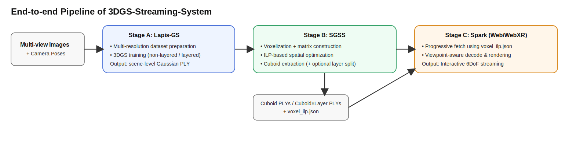

# 3DGS-Streaming-System Pipeline 梳理（论文图可直接复用）

## 1. 总览

本仓库是一个从 **多视角图像** 到 **6DoF 交互式流式渲染** 的端到端系统，主流程由三段组成：

1. **Lapis-GS**：训练分层（或非分层）3DGS 表示。
2. **SGSS**：对 3DGS 做空间分块（cuboid）与可选层内切分，并生成流式索引。
3. **Spark**：在 Web/WebXR 端进行渐进式传输与渲染。

---

## 2. 分阶段 Pipeline（输入 / 核心处理 / 输出）

### Stage A：数据准备与 3DGS 训练（`lapis-gs/`）

**输入**
- 多视角图像（COLMAP/NeRF-synthetic 等组织形式）。

**核心处理**
- 使用 `dataset_prepare.py` / `dataset_prepare.sh` 生成多分辨率数据。
- 使用 `train_full_pipeline.py` / `train_full_pipeline.sh` 训练 3DGS。
- 可配置为：
  - **非分层**：单分辨率训练（如仅 `resolution_scales=[2]`）。
  - **分层**：多分辨率逐层训练（如 `[16,8,4,2,1]`）。

**输出**
- 训练好的 Gaussian 表示（`.ply`），可作为后续 SGSS 的输入。

---

### Stage B：空间分块与流式组织（`SGSS/`）

**输入**
- 来自 Stage A 的全场景 `.ply`。

**核心处理**
- 运行 `run_all_scripts_detail.sh` 执行：
  - 体素化 / 基础分块
  - ILP 优化分块
  - 生成可流式 cuboid 文件
- 可选：若 Stage A 为分层 3DGS，则使用 `split_cuboids_to_layers_360.sh` 继续做 **cuboid × layer** 切分。

**输出**
- `cuboid_*.ply` 或 `cuboid_layer_*.ply`（按你的脚本命名而定）
- `voxel_ilp.json`（流式索引与元数据）

---

### Stage C：渐进式传输与渲染（`spark/`）

**输入**
- Stage B 产出的 cuboid 数据与 `voxel_ilp.json`。

**核心处理**
- `npm install`、`npm run dev` 启动 Web/WebXR 运行环境。
- 在示例（如 `spark/examples/webxr`）中配置：
  - `CUBOID_PLY_DIR`
  - `CUBOID_INDEX_URL`
- 客户端按视点和策略进行增量拉取、解码与渲染。

**输出**
- 6DoF 场景中的渐进式可视化体验（可适应带宽变化）。

---

## 3. 论文可用：最终 Pipeline 图（Mermaid）

> 可直接复制到支持 Mermaid 的 Markdown、论文附录、项目文档。

```mermaid
flowchart LR
    A[Multi-view Images / Camera Poses] --> B[Lapis-GS\nMulti-resolution Data Prep]
    B --> C[Lapis-GS\n3DGS Training\n(non-layered or layered)]
    C --> D[Scene-level Gaussian PLY]

    D --> E[SGSS\nVoxelization + Matrix Construction]
    E --> F[SGSS\nILP-based Spatial Optimization]
    F --> G[SGSS\nCuboid Extraction]

    G --> H{Layer split needed?}
    H -- No --> I[Cuboid PLYs + voxel_ilp.json]
    H -- Yes --> J[Split Cuboids into Layers]
    J --> K[Cuboid × Layer PLYs + voxel_ilp.json]

    I --> L[Spark/WebXR\nProgressive Fetch + Decode + Render]
    K --> L
    L --> M[Interactive 6DoF Streaming Experience]
```

---

## 3.1 论文图（SVG 成图版）



## 4. 论文排版建议（图注可直接用）

**Figure X. End-to-end pipeline of our 3DGS streaming system.**
Given multi-view images, we first train a scene representation with Lapis-GS (single-layer or layered). Then SGSS partitions the scene into optimized streaming cuboids and optionally splits each cuboid into layers for finer granularity. Finally, Spark performs viewpoint-aware progressive transmission and WebXR rendering using cuboid (or cuboid × layer) units and `voxel_ilp.json` metadata.

---

## 5. 一句话版本（可放摘要）

我们构建了一个“训练（Lapis-GS）→优化分块（SGSS）→渐进式传输渲染（Spark）”的端到端 3DGS 流式系统，实现了面向 6DoF 交互的带宽自适应与逐步加载。
